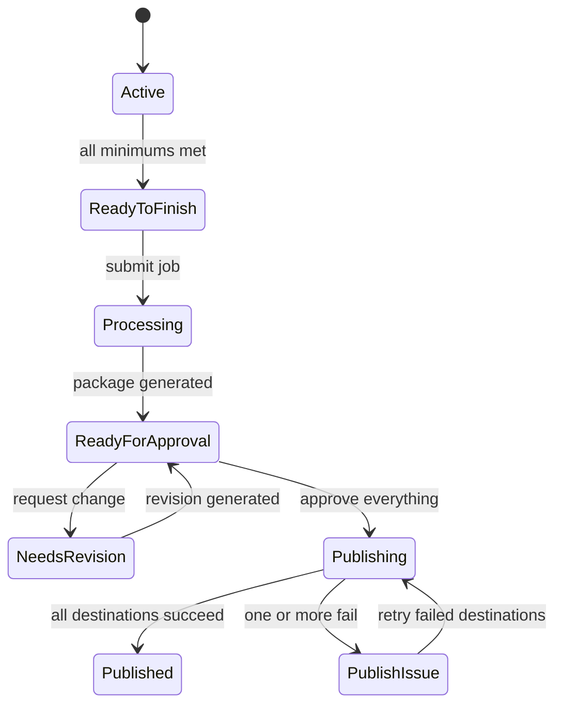

# JobbPulse Contractor App and Engine

## Master Build Document

**Build target:** A production-ready mobile-first Contractor App and the backend JobbPulse Engine

**Required project structure:** two separate project folders named `frontend` and `backend`

**Frontend:** Nuxt, Vue and TypeScript

**Backend:** FastAPI, PostgreSQL, background workers and object storage

**Social connection and publishing provider:** Upload-Post

---

## 1. Builder Role and Non-Negotiable Outcome

Act as the senior full-stack engineer responsible for delivering a working first version of JobbPulse. Build both applications, connect them through a documented API and leave the repository runnable locally with one clear setup path.

The finished system must let a contractor:

1. Sign in with minimal friction.
2. Create a job in less than one minute.
3. Add Before, Progress and After photos over time.
4. Optionally favorite photos without having to curate the final content.
5. Finish the job by recording one short voice description.
6. Submit the job and leave the app while JobbPulse processes it.
7. Return when the generated package is ready.
8. Review the featured transformation, project description and every generated content asset.
9. Request a change to a specific asset without learning a content editor.
10. Approve and publish the complete package with one action.
11. Connect and manage social accounts through Upload-Post from Settings.

The app's unique selling proposition is **stupid simple**. The contractor documents work already being performed. JobbPulse makes the decisions, creates the content and distributes it.

Do not turn the Contractor App into a CRM, social scheduler, design tool, photo editor, analytics dashboard or marketing control panel.

---

## 2. Source-of-Truth Order

When requirements appear to conflict, use this priority:

1. This master build document
2. The approved mockups in `mockups/`
3. General implementation judgment

**Current delivery scope:** Frontend-only Contractor App. Do not implement the backend JobbPulse Engine in this delivery. Implement a typed API client interface with a mock adapter so a future backend can be wired without rewriting screens.

**Product overrides for this delivery:**

- Photo minimum defaults (seed/demo): Before **2**, Progress **0**, After **2**. Progress remains a full category (upload, gallery, counts) but does not block Finish or Submit when empty.
- Auth: mock / dev sign-in until a backend OTP provider exists.
- Content generation and all publishers: simulated in the mock API client only.

The approved mockups supersede older list-style Approve/Reject ideas:

- Approval is a unified package experience with a horizontal generated-content carousel and asset-specific review pages. Do not build separate Approve and Reject button lists.

If a visual detail is not specified, extend the existing design system. Do not redesign an approved screen.

### Mockup file map

| Screen | File |
| --- | --- |
| My Jobs | `mockups/jobs_page.png` |
| Job Workspace | `mockups/job_workspace.png` |
| Photo Gallery | `mockups/photo_gallery.png` |
| Finish Job | `mockups/finish_job.png` |
| Review and Approve | `mockups/approval.png` |
| Content Review (Instagram) | `mockups/content_review_instagram.png` |
| Content Review (Facebook) | `mockups/content_review_facebook.png` |
| Content Review (website/gallery) | `mockups/content_review_gallery.png` |
| Settings | `mockups/social_media_settings.png` |
| Business Profile | `mockups/business_profile.png` |

---

## 3. Product Boundaries

### 3.1 Contractor App responsibilities

- Authentication and session handling
- Job creation and job list
- Photo capture, upload, categorization, favorites and basic management
- Voice recording and upload
- Submission validation
- Processing and review status
- Consolidated approval page
- Individual content review and revision requests
- Business profile and social connection settings
- Basic notification preferences

### 3.2 JobbPulse Engine responsibilities

- Persistent multi-tenant data
- Secure media upload orchestration
- Audio transcription
- Photo quality analysis, duplicate detection and automatic curation
- Featured Before and After pairing
- Project description generation
- Platform-specific social content generation
- Conversion Site content generation
- JobbPulse Portfolio Website content generation
- Versioned revision workflow
- Publish orchestration and status reconciliation
- Notifications and webhooks
- Audit trail and idempotency

### 3.3 External system boundaries

| System | Responsibility |
| --- | --- |
| Upload-Post | Connect contractor social accounts, publish social content and report social connection or delivery status |
| Contractor Conversion Site | Receive and display the contractor's recent-project entry and project page through an internal JobbPulse publisher |
| JobbPulse Portfolio Website | Receive and display the JobbPulse-owned contractor and completed-project pages through a separate internal publisher |
| JobbPulse Lead Desk / HighLevel | May deliver authentication links and notifications, but is not part of this application's CRM scope |

Never send Conversion Site or Portfolio Website content through Upload-Post. They are first-party publishing destinations.

B-Tab Internal is completely outside this project.

---

## 4. Required Repository Layout

Create one repository root with exactly two application folders:

```text
jobbpulse/
├── frontend/
│   ├── app/
│   ├── assets/
│   ├── components/
│   ├── composables/
│   ├── layouts/
│   ├── middleware/
│   ├── pages/
│   ├── plugins/
│   ├── public/
│   ├── stores/
│   ├── tests/
│   ├── types/
│   ├── nuxt.config.ts
│   ├── package.json
│   ├── .env.example
│   └── README.md
├── backend/
│   ├── app/
│   │   ├── api/
│   │   ├── core/
│   │   ├── db/
│   │   ├── models/
│   │   ├── repositories/
│   │   ├── schemas/
│   │   ├── services/
│   │   ├── integrations/
│   │   ├── publishers/
│   │   ├── tasks/
│   │   └── main.py
│   ├── alembic/
│   ├── tests/
│   ├── scripts/
│   ├── pyproject.toml
│   ├── alembic.ini
│   ├── .env.example
│   └── README.md
├── docker-compose.yml
├── Makefile
└── README.md
```

The background worker belongs inside `backend`. Do not create a third application folder.

---

## 5. Technical Stack

### 5.1 Frontend

- Current stable Nuxt with Vue 3 and TypeScript
- Composition API and `<script setup lang="ts">`
- Pinia for client state only where shared state is actually needed
- A typed API client generated from the backend OpenAPI document or maintained from shared schemas
- CSS variables plus component-scoped styles or a consistent utility system
- PWA-compatible manifest, icons and service worker behavior where practical
- Vitest for unit tests
- Playwright for critical mobile flows
- ESLint, TypeScript strict mode and formatting scripts

Avoid a heavy desktop component framework that fights the approved mobile visual language.

### 5.2 Backend

- Current stable FastAPI
- Python 3.12 or newer
- Pydantic v2
- SQLAlchemy 2 async patterns
- PostgreSQL
- Alembic migrations
- Redis for durable job coordination, caching and rate limiting
- Celery or an equivalent durable worker system inside `backend`
- S3-compatible object storage for photos, thumbnails and audio
- Pytest for unit and integration tests
- Ruff and static type checking
- OpenAPI generated by FastAPI

Do not use FastAPI `BackgroundTasks` for durable content generation or publishing. Processing must survive API restarts.

### 5.3 Local development

Provide Docker Compose services for:

- PostgreSQL
- Redis
- S3-compatible local object storage such as MinIO
- FastAPI API
- Background worker
- Nuxt development server

Provide one documented command to boot the complete local stack, run migrations and seed demo data.

---

## 6. Global UX and Visual System

Use the mockups as the visual authority.

### 6.1 Visual language

- Near-black page background
- Charcoal cards and panels
- White primary text
- Muted gray secondary text and borders
- Electric lime as the single dominant accent
- Rounded rectangular cards
- Bold, highly legible headings
- Large one-handed tap targets
- High contrast suitable for outdoor use
- Centered JobbPulse wordmark in internal headers
- Lime status pills and primary actions

Extract the precise implementation values from the mockups and centralize them as design tokens. Do not scatter raw color values throughout components.

### 6.2 Interaction rules

- One dominant action per screen
- Minimum 44 by 44 CSS pixel tap targets
- Never require drag and drop
- Never require precision gestures
- Never depend on an unlabeled icon when the action may be unclear
- Keep Before, Progress and After available at all times
- Suggested next actions are guidance, not category locks
- Prefer browser-native camera, file picker and audio APIs
- Avoid modal stacking
- Preserve partially completed work
- Show direct, plain-language errors with a retry action
- Respect safe-area insets on iPhone

### 6.3 Responsive behavior

The app is designed mobile first. It must work well in:

- iPhone Safari
- Android Chrome
- Browser views opened from HighLevel
- Tablet and desktop browsers without becoming stretched or sparse

On wide screens, center the app in a sensible maximum-width shell. Do not redesign it as a desktop dashboard.

### 6.4 Accessibility

- WCAG 2.2 AA contrast
- Semantic headings, buttons and form controls
- Visible keyboard focus
- Screen-reader labels for icons and media controls
- Status is communicated with text, not color alone
- Reduced-motion support
- Captions or readable text alternatives for generated visual previews where applicable

---

## 7. Navigation and Routes

Use minimal navigation. The menu may expose My Jobs and Settings. Do not build a broad dashboard.

| Route | Screen | Mockup |
| --- | --- | --- |
| `/sign-in` | Sign in and one-time-code flow | No final mockup. Extend the approved visual system. |
| `/jobs` | My Jobs | `mockups/jobs_page.png` |
| `/jobs/new` | Create Job | Extend the approved visual system. |
| `/jobs/:jobId` | Job Workspace | `mockups/job_workspace.png` |
| `/jobs/:jobId/photos/:category` | Photo Gallery | `mockups/photo_gallery.png` |
| `/jobs/:jobId/finish` | Finish Job | `mockups/finish_job.png` |
| `/jobs/:jobId/approval` | Review and Approve | `mockups/approval.png` |
| `/jobs/:jobId/approval/:assetId` | Content Review | `mockups/content_review_instagram.png`, `content_review_facebook.png`, `content_review_gallery.png` |
| `/settings` | Settings | `mockups/social_media_settings.png` |
| `/settings/business-profile` | Business Profile | `mockups/business_profile.png` |
| `/settings/social-return` | Safe return from Upload-Post connection flow | No standalone page design required. Redirect back to Settings with a status banner. |

Use route middleware for authentication and tenant authorization.

---

## 8. Screen Specifications

### 8.1 Sign In

Keep the first version simple:

1. Contractor enters email or phone.
2. Backend sends a one-time code or signed link through the configured authentication provider.
3. Contractor confirms the code.
4. Successful sign-in returns to the originally requested route or `/jobs`.

The sign-in screen must visually match the app. Do not add social login, password creation or a complicated onboarding wizard unless a configured identity provider requires it.

Provide a development-only authentication adapter that creates a visible test code in local logs. It must be impossible to enable this behavior in production by accident.

### 8.2 My Jobs

Match `jobs_page.png`.

Each job card shows:

- Cover photo
- Clear contractor-facing status
- Job name
- City and state or service location
- Before, Progress and After counts
- One contextual primary action

Contextual actions include:

- Add Before Photos
- Add Progress Photos
- Add After Photos
- Continue Job
- Review Content

Keep a persistent, obvious **New Job** action at the bottom. The list must support active, processing, awaiting approval and published jobs without separate dense dashboards.

### 8.3 Create Job

Required fields:

- Job name or customer identifier
- Service type
- City or service location

Optional fields:

- Street or neighborhood
- Short internal note
- Assigned crew member

The contractor must be able to create the job in under one minute. After successful creation, route directly to the Job Workspace.

### 8.4 Job Workspace

Match `job_workspace.png`.

Show:

- Back action
- Centered JobbPulse logo
- Job name
- Location
- Clear status pill
- Three category cards: Before, Progress and After
- Photo count and representative thumbnails for each category
- Category-specific Add button
- Explicit **Open Before Gallery**, **Open Progress Gallery** and **Open After Gallery** labels with chevrons
- Finish Job button

Behavior:

- The Add button opens the camera or photo picker for that category.
- The gallery label, chevron and non-button area of the card open the category gallery.
- All three categories remain available throughout the active job.
- The suggested next category may receive lime emphasis.
- Finish Job is disabled until all three configurable minimums are met.
- Disabled state includes plain helper text explaining what is missing.

### 8.5 Photo Gallery

Match `photo_gallery.png`.

Show:

- Current category title
- Job name
- Photo count
- **Minimum met** indicator when applicable
- Before, Progress and After category switcher
- Two-column thumbnail grid
- Optional favorite control on each photo
- One large category-specific Add Photos button

Interactions:

- Tap photo to open a full-screen viewer.
- Tap favorite to toggle the contractor preference signal.
- Full-screen viewer supports Favorite, Move Photo and Delete Photo.
- Move Photo allows Before, Progress or After.
- Delete requires confirmation and must be recoverable until server confirmation or handled as a soft delete.
- No crop, filters, enhancement controls, publishing choices or manual final-content selection.

Favorites are a strong curation signal but never a publishing command.

### 8.6 Finish Job

Match `finish_job.png`.

The photo check contains Before, Progress and After rows. Each row gets the same green-check logic when its configured minimum is met. Never show a completed overall state while one category remains gray.

Recorder states:

1. Lime **Start Recording**
2. Red **Stop Recording** with a visible timer
3. Completed playback state with duration, **Play Recording** and **Re-record**

The contractor can replace the recording before submitting. Recommended duration is 20 to 90 seconds, with a configurable hard maximum.

Prompt:

> Briefly describe what the customer needed, what you did and how it turned out.

Submit Job is enabled only when:

- All category minimums are met
- A valid voice recording exists
- Required uploads have completed

On submission, make an idempotent backend request, change the visible status to Processing and return to My Jobs after a short confirmation.

### 8.7 Processing

The contractor does not wait on the page.

Display:

> JobbPulse is creating your content. We’ll let you know when it’s ready for approval.

The job remains visible in My Jobs with a Processing status. Notify the contractor through enabled channels when the package becomes ready.

### 8.8 Review and Approve

Match `approval.png`.

This is the JobbPulse value-flex screen. It should visibly demonstrate how much JobbPulse created from a few photos and one recording.

Sections:

1. **Featured Transformation**
   - One selected Before photo and one selected After photo
   - **Change Featured Photos** action
2. **Project Description**
   - Generated description
   - **Request Text Change** action
3. **Your JobbPulse Content**
   - Horizontal swipeable preview carousel
   - The next card remains partly visible to communicate scrolling
   - Cards are generated dynamically for actual destinations
   - Each card includes destination label, real preview and **Tap to Review**
4. One large **Approve & Publish Everything** action

Do not show a publishing-destination checklist. Do not put helper subtext below the approval button.

Possible carousel cards:

- Facebook
- Instagram
- Google Business Profile
- TikTok
- X
- LinkedIn
- Contractor Conversion Site project entry
- JobbPulse Portfolio Website project page

Only show assets that were actually generated.

**Change Featured Photos** opens a simple Before and After chooser sourced from the job library. The Engine's recommendation remains selected by default.

**Request Text Change** opens the same compact voice-recording pattern. The contractor explains the correction, then the Engine regenerates the shared project description and dependent assets as a new version.

Nothing publishes until the contractor confirms **Approve & Publish Everything**.

### 8.9 Content Review

Use one route and one reusable page shell for every generated asset. Match the three approved examples.

Show:

- Destination-specific title
- Job name and Ready for Review status
- A realistic full preview renderer for that destination
- **Change Photos**
- **Change Wording**
- **Describe Another Change**
- One primary **Keep This Version** action

Do not build a rich text editor or social composition interface.

Revision flow:

1. Contractor chooses a change type.
2. If changing photos, show a simple selection using that job's photo library.
3. If changing wording or another detail, record a brief voice instruction.
4. Submit a revision request scoped to this asset.
5. Backend creates a new immutable asset version and regenerates only affected output.
6. Show the revised preview beside the decision **Use New Version** or **Keep Original**.
7. Return to the main approval page with the chosen version represented in the carousel.

The Instagram, Facebook and website preview components must look like the destination, but they must not copy live third-party interfaces so literally that branding or policy compliance becomes fragile. Build platform renderer components behind a common interface.

### 8.10 Settings

Match `social_media_settings.png`.

Sections:

- Business Profile summary and **Edit Business Profile**
- Social Accounts
- Notification preferences
- Sign Out

Show these social rows:

- Facebook
- Instagram
- Google Business Profile
- TikTok
- X
- LinkedIn

Each row supports:

- Connected
- Not connected
- Reconnect required
- Connection pending
- Provider unavailable

The only management action is **Manage Social Accounts**. It opens the Upload-Post-hosted connection experience and returns to Settings. Do not expose API terms, tokens, posting schedules or platform-specific configuration.

### 8.11 Business Profile

Match `business_profile.png`.

Fields:

- Business name
- Contact name
- Phone
- Email
- Website
- Service area

Provide Save Changes, inline validation and an unsaved-change warning. Keep social connections out of this screen.

---

## 9. Photo and Audio Handling

### 9.1 Photo rules

Contractors may capture generously. Use configurable technical guardrails rather than small creative limits. Initial defaults may be:

- Before: maximum 15
- Progress: maximum 30
- After: maximum 15

Minimums are tenant-configurable. Seed demo defaults that satisfy the approved Finish Job mockup. Never hardcode minimums into the frontend.

Each photo stores:

- Company and contractor ownership
- Job
- Category
- Original object key
- Derived thumbnail and preview keys
- MIME type and byte size
- Width, height and orientation
- Capture timestamp when available
- Upload timestamp
- Favorite signal
- Sort-independent stable ID
- Upload checksum for duplicate protection
- Soft-delete state

### 9.2 Upload architecture

Use a two-step upload flow:

1. Frontend asks FastAPI for an upload session and presigned object-storage URL.
2. Frontend uploads directly to object storage, then confirms completion to FastAPI.

Requirements:

- Visible per-file progress
- Client-side resize or compression for an upload derivative while preserving enough quality for marketing use
- Original retained when configured
- Retry with exponential backoff
- Idempotency key per file
- Local pending-upload queue using IndexedDB
- Resume or reselect guidance after browser interruption
- Parallel uploads with a conservative concurrency limit
- Screen remains usable during upload
- Submit is blocked only by required incomplete uploads

Never silently lose a photo.

### 9.3 Audio

Use MediaRecorder when supported. Detect a compatible MIME type at runtime. Provide a fallback file upload when recording is unavailable.

Persist:

- Object key
- MIME type
- Duration
- File size
- Version
- Created by
- Upload state

Replacing a recording creates a new version and retires the old active version without destructive deletion.

---

## 10. Job and Package State Machines

### 10.1 Contractor-facing job statuses

Use a small public vocabulary:

- Active
- Ready to Finish
- Processing
- Ready for Approval
- Needs Revision
- Publishing
- Published
- Publish Issue

The UI may use contextual labels such as Needs After Photos or In Progress, but the backend state remains normalized.

### 10.2 Internal processing states

Internal states may include:

- `draft`
- `submitted`
- `queued`
- `transcribing`
- `curating_media`
- `generating`
- `ready_for_approval`
- `revision_requested`
- `regenerating`
- `approved`
- `publishing`
- `published`
- `partially_failed`
- `failed`

Do not expose these internal stage names to contractors unless mapped to a plain-language public status.

### 10.3 Required transitions



Every transition must be validated server-side and written to an audit/event table.

---

## 11. Data Model

Use UUID primary keys and timezone-aware timestamps. All tenant-owned tables include `company_id`, with composite indexes that support tenant-scoped queries. Never trust a `company_id` submitted by the client without deriving or validating it against the authenticated principal.

### 11.1 Core tables

#### `companies`

- `id`
- `name`
- `slug`
- `account_status`
- `phone`
- `email`
- `website`
- `service_area`
- `photo_minimums_json`
- `notification_settings_json`
- timestamps

#### `contractors`

- `id`
- `company_id`
- `name`
- `email`
- `phone`
- `role`
- `status`
- timestamps

#### `auth_identities`

- `id`
- `contractor_id`
- `provider`
- `provider_subject`
- `last_authenticated_at`
- timestamps

#### `jobs`

- `id`
- `company_id`
- `created_by_contractor_id`
- `name`
- `service_type`
- `city`
- `region`
- `location_text`
- `internal_note`
- `assigned_crew_member`
- `public_status`
- `internal_status`
- `submission_version`
- `submitted_at`
- `approved_at`
- `published_at`
- timestamps

#### `media_assets`

- `id`
- `company_id`
- `job_id`
- `uploaded_by_contractor_id`
- `kind` (`photo` or `audio`)
- `photo_category` (`before`, `progress`, `after` or null)
- `original_object_key`
- `preview_object_key`
- `thumbnail_object_key`
- `mime_type`
- `byte_size`
- `width`
- `height`
- `duration_ms`
- `checksum`
- `upload_status`
- `is_favorite`
- `is_deleted`
- `version`
- timestamps

#### `job_submissions`

- `id`
- `company_id`
- `job_id`
- `version`
- `voice_media_asset_id`
- `snapshot_json`
- `idempotency_key`
- `submitted_by_contractor_id`
- timestamps

#### `content_packages`

- `id`
- `company_id`
- `job_id`
- `submission_id`
- `version`
- `status`
- `project_description`
- `featured_before_media_id`
- `featured_after_media_id`
- timestamps

#### `generated_assets`

- `id`
- `company_id`
- `package_id`
- `destination_type`
- `destination_account_id`
- `title`
- `body`
- `payload_json`
- `preview_json`
- `status`
- `active_version_id`
- timestamps

#### `generated_asset_versions`

- `id`
- `generated_asset_id`
- `version`
- `source_media_ids_json`
- `title`
- `body`
- `payload_json`
- `preview_json`
- `generation_metadata_json`
- `created_at`

#### `revision_requests`

- `id`
- `company_id`
- `job_id`
- `generated_asset_id` nullable for package-description changes
- `change_type`
- `instruction_audio_media_id` nullable
- `selected_media_ids_json` nullable
- `transcribed_instruction` nullable
- `status`
- `requested_by_contractor_id`
- timestamps

#### `social_profiles`

- `id`
- `company_id`
- `provider` fixed to `upload_post`
- `provider_username`
- `status`
- timestamps

Use one Upload-Post profile per company, not per individual contractor, because the connected social accounts belong to the contractor business.

#### `social_connections`

- `id`
- `company_id`
- `social_profile_id`
- `platform`
- `provider_account_name`
- `provider_account_id` nullable
- `status`
- `reason` nullable
- `last_event_at`
- timestamps

#### `publication_attempts`

- `id`
- `company_id`
- `job_id`
- `generated_asset_id`
- `destination_type`
- `provider`
- `provider_request_id` nullable
- `provider_job_id` nullable
- `idempotency_key`
- `status`
- `attempt_number`
- `request_snapshot_json`
- `response_snapshot_json`
- `last_error_code` nullable
- `last_error_message` nullable
- timestamps

#### `webhook_events`

- `id`
- `provider`
- `provider_event_id` or deterministic payload hash
- `event_type`
- `payload_json`
- `received_at`
- `processed_at`
- `processing_status`
- `error_message` nullable

#### `job_events`

- `id`
- `company_id`
- `job_id`
- `event_type`
- `actor_type`
- `actor_id` nullable
- `payload_json`
- `created_at`

---

## 12. API Contract

Version the API under `/api/v1`. Use JSON except for explicitly documented upload operations. Return a consistent error envelope with a stable code, plain-language message and optional field errors.

### 12.1 Authentication and account

- `POST /api/v1/auth/challenge`
- `POST /api/v1/auth/verify`
- `POST /api/v1/auth/refresh`
- `POST /api/v1/auth/logout`
- `GET /api/v1/me`
- `GET /api/v1/company`
- `PATCH /api/v1/company`
- `GET /api/v1/company/settings`
- `PATCH /api/v1/company/settings`

### 12.2 Jobs

- `POST /api/v1/jobs`
- `GET /api/v1/jobs?status=&cursor=`
- `GET /api/v1/jobs/{job_id}`
- `PATCH /api/v1/jobs/{job_id}`
- `POST /api/v1/jobs/{job_id}/submit`
- `GET /api/v1/jobs/{job_id}/status`
- `GET /api/v1/jobs/{job_id}/events`

Use cursor pagination. `POST /submit` requires an idempotency key.

### 12.3 Media

- `POST /api/v1/jobs/{job_id}/media/upload-sessions`
- `POST /api/v1/jobs/{job_id}/media/{media_id}/complete`
- `GET /api/v1/jobs/{job_id}/media?category=`
- `PATCH /api/v1/jobs/{job_id}/media/{media_id}` for favorite or category changes
- `DELETE /api/v1/jobs/{job_id}/media/{media_id}`
- `POST /api/v1/jobs/{job_id}/voice/upload-sessions`
- `POST /api/v1/jobs/{job_id}/voice/{media_id}/complete`

### 12.4 Generated package and revisions

- `GET /api/v1/jobs/{job_id}/package`
- `PATCH /api/v1/jobs/{job_id}/package/featured-media`
- `POST /api/v1/jobs/{job_id}/package/description-revision`
- `GET /api/v1/jobs/{job_id}/generated-assets`
- `GET /api/v1/generated-assets/{asset_id}`
- `POST /api/v1/generated-assets/{asset_id}/revisions`
- `POST /api/v1/generated-assets/{asset_id}/select-version`
- `POST /api/v1/jobs/{job_id}/approve-and-publish`

### 12.5 Social connections

- `GET /api/v1/social/connections`
- `POST /api/v1/social/connect-url`
- `POST /api/v1/webhooks/upload-post`

`POST /social/connect-url` creates or retrieves the company's Upload-Post user profile, requests a temporary connection URL and returns only the URL and expiration to the authenticated frontend.

### 12.6 Operations

- `GET /health/live`
- `GET /health/ready`
- Protected retry endpoint for failed publication attempts
- Protected dead-letter inspection appropriate for operations, not exposed in the Contractor App

---

## 13. JobbPulse Engine Pipeline

Submission creates a durable orchestration workflow:

1. Validate the submission snapshot.
2. Lock the submission version so later photo changes do not mutate the in-flight package.
3. Transcribe the voice recording.
4. Analyze photos for sharpness, lighting, duplicates, visible work, sensitive content and useful matching angles.
5. Prefer contractor favorites when quality is acceptable.
6. Select one featured Before and one featured After image.
7. Select a curated supporting set of Progress and finished-work photos.
8. Generate a factual project description grounded only in job inputs and transcript.
9. Generate platform-specific assets for connected and enabled social platforms.
10. Generate the Contractor Conversion Site asset.
11. Generate the JobbPulse Portfolio Website asset.
12. Persist previews and immutable versions.
13. Change the job to Ready for Approval.
14. Send the ready notification.

The Engine must not invent warranties, pricing, materials, certifications, customer quotes or project facts that were not supplied.

Implement transcription, media analysis and content generation behind provider interfaces. Production providers are configured by environment variables. A deterministic fake provider is allowed only for local development and automated tests.

---

## 14. Upload-Post Integration

Upload-Post is the required social connection and publishing provider. Keep every API key and provider call in the FastAPI backend. The Nuxt app never calls Upload-Post directly.

### 14.1 Profile lifecycle

- Create an Upload-Post user profile through `POST /uploadposts/users`.
- Use a stable opaque username derived from the JobbPulse company ID, not the company email.
- Store the mapping in `social_profiles`.
- Treat a provider `409` during create as idempotent, then fetch the existing profile.
- Never delete an Upload-Post profile as part of ordinary disconnect or employee removal because deletion also removes associated social connections.

### 14.2 Connection flow

Use `POST /uploadposts/users/generate-jwt` to generate the secure temporary connection URL.

Request values should include:

- Company provider username
- Redirect back to `/settings/social-return`
- JobbPulse logo URL
- `connect_title`: `Connect Your Social Accounts`
- `connect_description`: `Choose where JobbPulse can publish your completed jobs.`
- Clear return-button text
- `show_calendar: false`
- English or detected supported language

The initial Settings UI contains Facebook, Instagram, Google Business Profile, TikTok, X and LinkedIn.

**Provider contract warning:** the supplied Upload-Post schema's `generate-jwt` platform filter explicitly lists Facebook, Instagram, TikTok, X and LinkedIn but does not list Google Business Profile. Other provider enums and webhook examples do list `google_business`. Treat Google Business Profile connection as a production integration gate:

1. Confirm the currently supported provider connection method.
2. Add it through the supported filtered or provider-specific path.
3. Do not send an invalid enum value.
4. Keep the UI and internal platform model ready for it.
5. Do not fake a connected state.

If Upload-Post supports Google Business Profile only when the connection page is unfiltered, isolate that behavior behind configuration and verify the rendered page does not expose irrelevant platforms before production.

### 14.3 Connection status

Configure Upload-Post webhook events:

- `social_account.connected`
- `social_account.disconnected`
- `social_account.reauth_required`
- `upload_completed`

Map provider status to Connected, Not connected or Reconnect required. Webhook processing must be idempotent and tolerant of out-of-order delivery.

Verify webhook authenticity using the provider-supported mechanism. If the supplied spec does not define a signature, use an unguessable webhook URL token plus network and payload validation, then confirm the recommended signing method with Upload-Post before production.

### 14.4 Social publishing

Use `POST /upload_photos` for photo-based completed-job content. Use asynchronous uploads where appropriate and persist the returned `request_id` or `job_id`.

Generate a separate payload per platform even when Upload-Post can accept multiple platforms in one call. This preserves asset-specific review, clean retry behavior and accurate delivery status.

Required initial destination adapters:

- Facebook
- Instagram
- Google Business Profile, subject to the provider gate above
- TikTok photo post
- X
- LinkedIn

Map platform-specific fields inside the backend adapter, including Facebook Page ID, LinkedIn organization target and platform-specific titles or descriptions when required. Contractors do not see these controls.

Publishing rules:

- Do not publish before package approval.
- Use a unique idempotency key per asset version and destination.
- Store sanitized request and response snapshots without credentials.
- Retry transient failures with bounded exponential backoff and jitter.
- Do not retry permanent authorization errors. Mark Reconnect required.
- A partial failure must not duplicate successful posts.
- Report a plain Publish Issue status with a support-friendly detail code.

### 14.5 Provider isolation

Create an interface such as `SocialPublisher` with an Upload-Post implementation. Do not let provider payload shapes leak into core models, API schemas or frontend types.

---

## 15. First-Party Website Publishers

Create two separate publisher interfaces and implementations:

### 15.1 Conversion Site publisher

Publishes the contractor's recent-project carousel entry and canonical project page. Payload should include:

- Company ID
- Job ID
- Slug
- Featured Before and After images
- Curated gallery
- Project description
- Service type
- General service location
- Publish and update timestamps

### 15.2 JobbPulse Portfolio publisher

Publishes or updates the JobbPulse-owned contractor project page. Keep its destination identifier and lifecycle separate from the Conversion Site record even if both use similar content.

Both publishers must support create-or-update semantics so approved revisions update the existing project instead of creating duplicates.

Use adapters and environment-configured API endpoints. Provide local fake implementations for end-to-end development.

---

## 16. Security and Privacy

- Enforce company isolation in every repository query.
- Use short-lived access tokens with secure refresh rotation or secure server sessions.
- Store refresh tokens in HttpOnly, Secure and SameSite cookies.
- Apply CSRF protection when cookie authentication is used.
- Use presigned storage URLs with short expirations and content restrictions.
- Validate MIME type, magic bytes, size and dimensions server-side.
- Strip or intentionally handle EXIF GPS data. Never publish precise homeowner coordinates.
- Treat photos as private property data until approved for publishing.
- Keep Upload-Post credentials server-side and encrypted at rest when stored.
- Never log access tokens, signed URLs, recording contents or raw provider secrets.
- Rate limit auth, upload-session, revision and publish endpoints.
- Audit account changes, submission, approval, revision and publishing events.
- Provide retention hooks for account deletion and legal holds without destructive cascades by default.

The public job page should show only the general city, neighborhood or approved service area, never a private street address unless explicitly authorized.

---

## 17. Reliability, Offline Behavior and Error Handling

Required plain-language cases:

- No internet connection
- Photo upload failed
- Audio recording unsupported
- Audio upload failed
- Minimum photos missing
- Session expired
- Submission failed
- Content is still processing
- Revision generation failed
- Social account requires reconnection
- One publishing destination failed

Use an IndexedDB-backed upload queue for pending media and client-generated idempotency keys. Display upload state on the relevant photo rather than blocking the whole screen.

The worker must use retry policies, dead-letter handling and task correlation IDs. Every job submission and publication attempt must be safe to run more than once.

---

## 18. Notifications

Support configurable channels:

- Content ready for approval
- Publishing complete

The first version may deliver through SMS or email using a configured JobbPulse Lead Desk or notification adapter. Push notifications are not required.

Each notification includes a signed deep link to the exact job approval page. After authentication, preserve the destination.

---

## 19. Seed Data and Visual Fidelity

Provide a seed script that creates the mockup demonstration account:

- Company: Johnson Outdoor Living
- Contact: Mike Johnson
- Service area: Metro Atlanta
- Jobs representing Johnson Deck Rebuild, Miller Kitchen Cabinets and Thompson Exterior Painting
- Before, Progress and After counts matching the approved examples where practical
- One package ready for approval with Instagram, Facebook, Conversion Site and Portfolio previews
- Social connection examples showing connected and not-connected states

Use properly licensed or local placeholder images in development. Do not depend on expiring remote image URLs.

Create a Playwright screenshot test at the approved mobile viewport for each mocked route. Visual diffs should protect hierarchy, spacing and interaction states without making ordinary antialiasing changes impossible.

---

## 20. Testing Requirements

### 20.1 Frontend tests

- Route guards and return-to behavior
- Job-card contextual action mapping
- Photo minimum logic sourced from the API
- Category switching
- Favorite, move and delete interactions
- Upload queue retry and recovery
- Recorder state machine
- Submit-button enablement
- Horizontal content carousel
- Asset-specific revision flow
- Settings connection statuses
- Mobile viewport screenshot tests

### 20.2 Backend tests

- Tenant isolation
- Authentication challenge expiration and replay prevention
- Upload-session authorization
- Media completion idempotency
- Submission validation and idempotency
- State transition guards
- Worker retry behavior
- Content version immutability
- Asset-specific regeneration
- Approve-and-publish idempotency
- Upload-Post profile creation conflict handling
- Connection webhook deduplication and out-of-order handling
- Upload completion webhook mapping
- Partial publish failure without duplicate successful posts
- First-party publisher create-or-update behavior

### 20.3 End-to-end acceptance path

Automate this flow:

1. Sign in.
2. Create a job.
3. Add Before photos.
4. Leave and return.
5. Add Progress photos.
6. Add After photos.
7. Favorite one photo.
8. Record, play and re-record the description.
9. Submit once even if the user double taps.
10. Run the fake Engine to Ready for Approval.
11. Review the package carousel.
12. Request and accept one asset revision.
13. Approve and publish everything.
14. Confirm social and first-party destination attempts.
15. Confirm the job reaches Published or Publish Issue without duplicates.

---

## 21. Definition of Done

The build is complete only when:

- `frontend` and `backend` are separate runnable project folders.
- The complete local stack starts from documented commands.
- Database migrations run from a clean database.
- Seed data recreates the approved workflow.
- Every approved mockup route exists and is functional.
- Photo capture, multi-select upload, retry, favorite, move and delete work.
- All three category minimums are enforced by the backend and reflected by the frontend.
- Voice start, stop, playback and re-record work on supported mobile browsers.
- Job submission is durable and idempotent.
- The worker produces a versioned package through a configured provider or deterministic development adapter.
- The review page uses the horizontal real-preview carousel.
- Instagram, Facebook and website Content Review variants work through the shared component system.
- Asset-specific revisions regenerate only what is affected.
- Settings connects through the Upload-Post JWT URL flow.
- Social account webhooks update connection state.
- Approved social assets publish through Upload-Post adapters.
- Conversion Site and Portfolio Website assets publish through separate first-party adapters.
- Partial publishing failures are recoverable without duplicate successful posts.
- Tests, linting and type checks pass.
- No secrets are committed.
- API docs and environment variables are documented.
- The Contractor App can be used end to end without training.

---

## 22. Explicit Non-Goals for Version One

Do not add:

- CRM or lead pipeline features
- Invoicing, estimates or scheduling
- Customer messaging inbox
- Analytics dashboards
- Manual social calendar
- Per-platform publishing switches in the main workflow
- Rich text or design editors
- Image filters, cropping or enhancement tools
- Native iOS or Android apps
- Push notifications
- GPS employee tracking
- Public lead-generation directory browsing inside the Contractor App
- B-Tab Internal functionality

---

## 23. Required Handoff

Deliver:

1. Complete `frontend` project folder
2. Complete `backend` project folder
3. Root Docker Compose and developer commands
4. Database migrations and seed data
5. `.env.example` files with every variable documented
6. OpenAPI document and typed frontend client
7. Architecture notes covering the Engine pipeline and publisher adapters
8. Upload-Post integration notes including the Google Business Profile verification gate
9. Test suite and test commands
10. A short production deployment checklist

Do not return only scaffolding, pseudo-code or screenshots. Build the working application.

